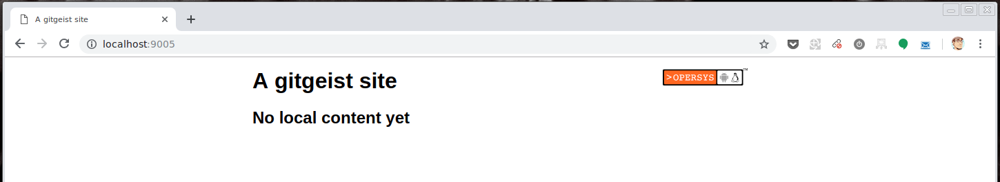
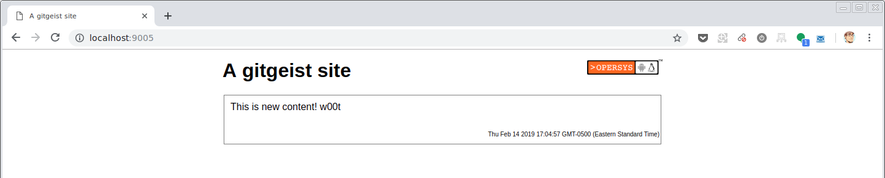
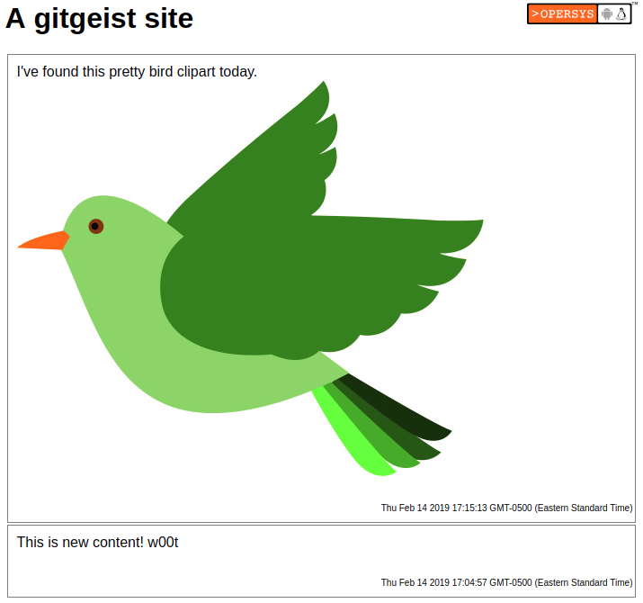
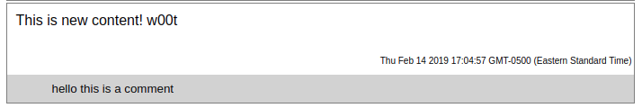
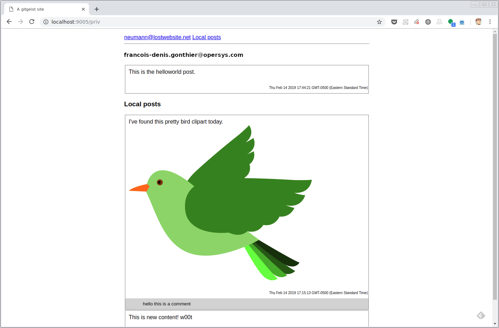
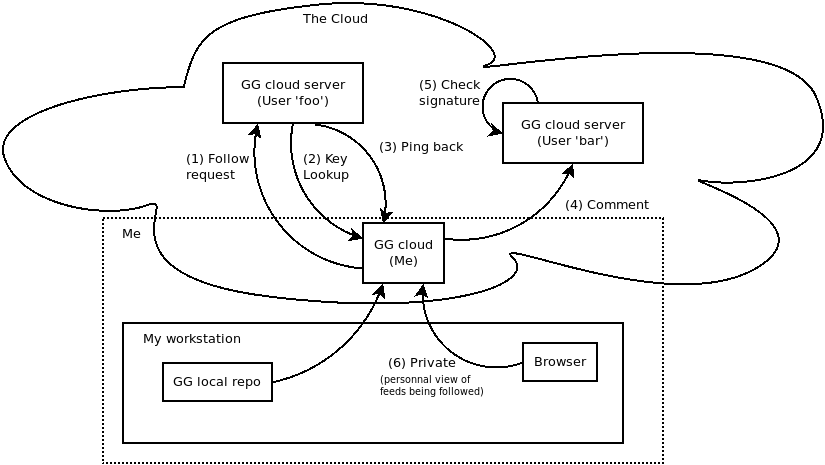

# gitgeist proof-of-concept user manual

gitgeist is a new kind of social network that uses Git as a storage backend and transfer protocol.

Posts and comments are stored in a Git repository which is used by the engine to generate a static web page that is served over HTTP by Node.js.

## Requirements

You need a fairly recent (10.x) version of Node.js in order to use gitgeist. Recent versions of Git and GPG are also recommended.

## Quickstart

The following is a very quick and dirty way to get started testing gitgeist. It assumes you have a GPG key with an email associated to a certain email address (here represented by your.email@address.com).

Clone the gitgeist source repo

    $ git clone https://github.com/opersys/gitgeist-poc.git gitgeist

Create a directory to host your content and go to it:

    $ mkdir blog
    $ cd blog

Symlink the gitgeist scripts to the directory for easy access; assuming the checkout of gitgeist was done in the same parent directory as the *blog* directory.
	
    $ ln -s ../gitgeist scripts
    
Initialize the repository (hosting IP, port, your email address and username/password for accessing your "view of the world")

    $ scripts/init localhost 9005 your.email@address.com test test
    
Start the HTTP server

    $ scripts/server
      
At this point, you can browse the currently empty site at http://localhost:9005. 

To create new content without shutting down the HTTP server, open a new terminal and use those commands -- in real life you'd be hosting the above server on some cloud instance and the following would be the local copy you'd use on your workstation to post back to your public instance.
   
    $ git clone http://localhost:9005/git ggeist-local
    $ cd ggeist-local
    $ git config user.signingkey $(./getkeyid your.email@address.com)
    $ mkdir -p posts/0001
    $ echo 'This is new content! w00t' > posts/0001/index.md
    $ git add posts
    $ git commit -S -m "First post"
    $ git push
        
You should automatically see the browser update itself with the new content you've just created.

        
## Starting

Let's expand on the quickstart section by further describing the above commands.

Cloning the gitgeist Git repository somewhere on your host gives you what you need to generate a gitgeist instance. 

    $ git clone https://github.com/opersys/gitgeist-poc.git gitgeist

The script directory can be directly used in your hosting directory. In order to facilitate sharing the code accross instances, though, we recommend creating *scripts* as a symbolic link inside the target blog directory.

    $ ln -s ../gitgeist scripts

The scripts directory includes all the commands needed to initialize a gitgeist node.

Prior to executing the initialisation of the node Git repository, you need to make sure that you have a GPG key to validate your commits with your gitgeist server instance.

The 'init' script will initialize a target directory with the files required for a gitgeist node to run.

    $ scripts/init hostname port email username password

The 'init' script requires 5 parameters to initialize the node

* *hostname*: The hostname of the computer on which the server will be running.
* *port*: The port number on which the node will listen.
* *email*: The email address associated with the GPG key that you want to use to validate commits uploaded to the node.
* *username*: Username to access the private section (i.e. your view of all feeds you follow)
* *password*: Password to access the private section

Finally, to start the gitgeist internal HTTP server, run the *server* script.

    $ scripts/server 

The server hosts a static HTML page and makes it accessible over HTTP at the hostname/port of your choosing. Presently, this is a very basic interface and it's not interactive. Given that this is a proof-of-concept there was little to no effort put into the presentation and UX. The point was to show the overall functionality. There's of course a lot that could be done to improve the presentation layer and make it much more closer to the generally-accepted interfaces for this type of application, including auto-refresh, etc.

## Posting

To post, you need to clone the Git repository backing the gitgeist node storage. You can directly clone from the Git backend through the HTTP protocol:

    git clone http://[hostname]:[port]/git gitgeist-node

You can also clone the Git repository directly if you're on the same host as the node, or you can use Git over SSH. The way the repository is cloned doesn't matter.

Because the commits need to be signed with GPG, the cloned Git repository needs to be initialised to use the right GPG key.

    $ git config user.signingkey [ID of you GPG key]
      
As usual, the ID of the GPG key is an long string of hexadecimal characters.

    % gpg --list-keys
    /home/neumann/.gnupg/pubring.kbx
    --------------------------------
    pub   rsa3072 2019-01-15 [SC] [expires: 2021-01-14]
          82B0C739018B95F302C183344D886CDB7892496A
    uid           [ultimate] François-Denis Gonthier <neumann@lostwebsite.net>
    sub   rsa3072 2019-01-15 [E] [expires: 2021-01-14]
    
The ID of the GPG key to use here is 82B0C739018B95F302C183344D886CDB7892496A

The *getkeyid* script that is automatically included in the initial cloned repository may do that job for you. *getkeyid* returns the ID of the key corresponding to the email you ended as an argument. Assuming your run the [GNU Bash shell](https://www.gnu.org/software/bash/) (or a [variant thereof](http://www.zsh.org/)), you can use it that way in the *git* command line.

    $ git config user.signingkey $(./getkeyid your.email@address.com)

To post a new entry, you need to create a new directory in the 'posts' directory on the host. The name of the directory matters if you want your post to appear in a logical order. We recommend to prepend the directory name with a post number, ex: *0001-HelloWorld*, *0002-SecondPost*. In this example, the post numbered 0002 would appear before the post numbered 0001 on the gitgeist node's public page.

The post content must be be called index.md and be written in Markdown. We use the [markdown-it](https://markdown-it.github.io/) variant of Markdown.

Once you've written your post, you need to commit it as you would with any other Git repository.

    $ git add posts
    ...
    $ git -S commit -m "New post"

Each commit needs to be *signed* to be accepted by the gitgeist server. This is the reason the -S argument is used on the *git commit* command line. The GPG key used to sign the commit needs to be the private key corresponding to the key used to initialise the repository. The update Git hook will validate the signature of the commits using that key.

The next step is to send the commits to the server.

    $ git push

Once the new post gets successfully pushed, the static page will regenerate itself.

### Images

The post can include images or other binary files. In order to be linked properly in the generated HTML code, the full path to the file, starting from the root of the Git repository must be given in the Markdown code.

For example, if you want to insert an image called image.png in your post, here is what you must do:

    

Here is an example in context:

## Following & Unfollowing

Following and unfollowing other users of gitgeist is what makes it a "social" network. When you're following other users, you'll automatically get notified when those users make changes to their repositories.

Following other gitgeist users is a matter of know their instances' URLs. In the root of the Git repository, a file called "following" was inserted at node initialisation. It's initialy empty but it's meant to include the list of URLs that your instance follows.

The gitgeist server monitors changes to this file to track the URLs of the hosts it's suposed to follow. Adding and removing URLs from this list will make the server follow or unfollow those URLs.

You can directly modify this file on the host. You can also remotely push commits modifying the file for the same effect.

    $ echo "http://localhost:9005" >> following
    $ git add following
    $ git commit -m "New follower: localhost:9005"
    $ git push

This remotely adds a new follower to the target server. A few seconds after the change is noticed, the target server will clone the remote repository and make its content accessible in your instance's the private section -- the one accessed using the username/password you used to create the instance above.

## Commenting

Following someone allows you to comment on their posts through their Git repository. We understand that isn't ideal and ideally: 1) you wouldn't want/need to push to a git repo to comment (you're effectively giving direct write access to others to your own git repo), and 2) you wouldn't need to follow to be able to comment. Again, this implementation is a proof-of-concept and the point is to show what's possible with this approach. A clean reimplementation would likely use node.js-based POSTs for requesting remote instances add comments and possibly even allow integration with existing social network IDs such as Google, FB, Twitter or otherwise.

Presently the only difference there is between creating a new posts in your own repository and commenting in a third-party repository is that, in the latter case, you're only allowed to add content in a *comments* directory under the posts you want to comment on.

Supposing http://localhost:9005 is a third party repository that I'm following. In order to comment on post *0001*, I can create a *comments* directory within the directory of that posts and add my comments there -- alternatively we could also have the *comments* directory being automatically created when a post is first posted.

    $ git clone http://localhost:9005/git git-comments
    $ cd git-comments
    $ git config user.signingkey $(./getkeyid your.email@address.com)
    $ mkdir -p posts/0001/comments
    $ echo "hello this is a comment" > posts/0001/comments/hello.md
    $ git add posts/0001
    $ git commit -m "Added comment" -S
    $ git push
    
Once your push is accepted by the server, it will appear as a comment below the post that you've selected. Comments are not ordered yet and will show up in filesystem order. A proper final implementation would need to standardize on some meta-data generation/storage for comments, approvals ("+1"s, "-1"s, etc.), editing, etc.

## Private section

gitgeist does not make public the posts it gathers from the repositories you follow. To view the posts of all the nodes you are following, you can access the *priv* path in your URL.

This page will be protected with basic HTTP authentication and the username and passwords that you've set when you've initialised the repository.

The following example shows what it's like to follow another site in the private section.

## Technical reference

#### HTTP Endpoints

The gitgeist server offers a few HTTP API endpoints that are used to access some of the features of the node or to allow communication between nodes.

|Endpoint|Description|
|--------|-----------|
|ping    | Needs a *url* parameter. When received, this makes the node pull from the Git repository at *url* provided that it is currently followed by the target node. This is what makes your view of the world auto-update when others post.|
|key     |Return the GPG public key that uniquely identify this server. This is used to validate follow requests and therefore enable ping-back.|
|git     |Exposes the underlying Git repository to other nodes or users. Can be pushed to with signed commits.|
|follow  |Needs a *url* parameter. Sent by nodes that desire to be informed of updates. Commits by the node user needs to be signed by the private key corresponding to the node's public GPG key. (See the /key endpoint)|
|unfollow|Needs a *url* parameter. Sent by nodes that no longer desire to be informed of updates.|
|priv    |Private user section of the site, controlled by HTTP Basic authentication.|
|logo    |Returns the content of logo.png in the root of the Git repository. Allows for customization of the site logo.|
|style   |Returns the content of style.css in the root of the Git repository. Allows for the customization of the site style.|
|posts   |Allows for posts to refer to content stored under the /posts directory in the Git directory.|

### Git Hooks

|Hook name|Effect|
|---------|------|
|update|Valide the GPG signature of the commits. Validate that the commits pushed to the node are allowed.|
|post-update|Update the page using the content of the Git repository. Advertise to followers that the repository has changed.
|post-commit|Update the page using the content of the Git repository. Advertise to followers that the repository has changed.|

# Architecture

